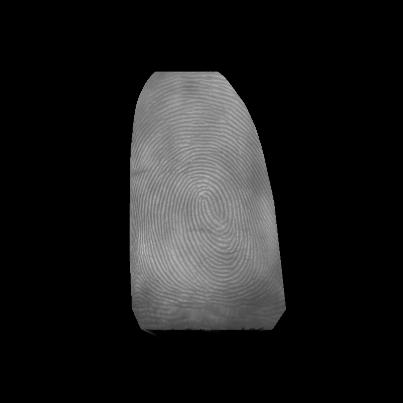
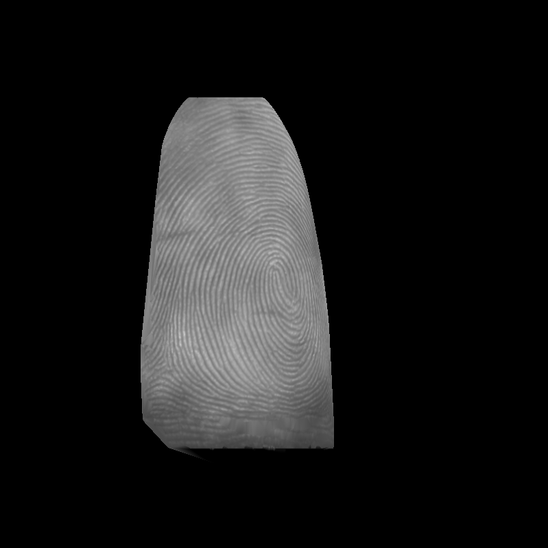
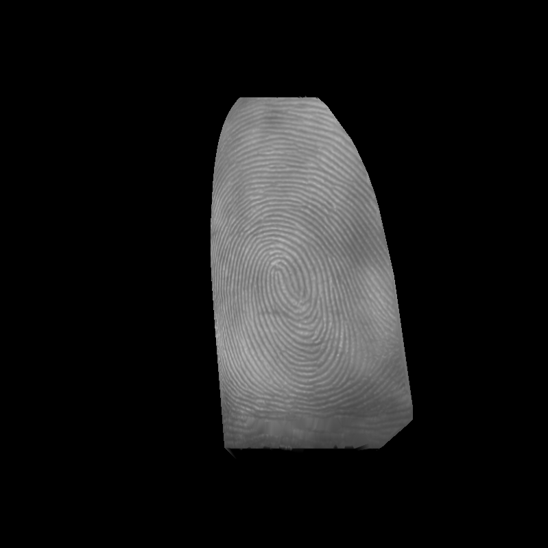
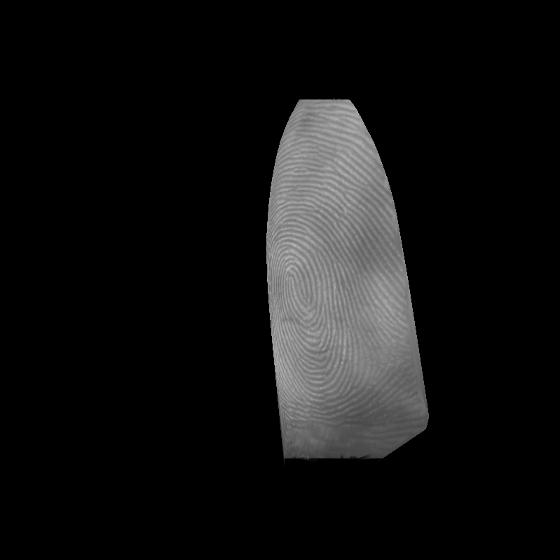

# IMPOSE: Identity-Consistent Multi-Pose Generation of Contactless Fingerprints

> **Paper status**: Under review.

## Overview

**IMPOSE** is a physics-inspired generative framework for synthesizing identity-consistent, multi-pose contactless fingerprint samples to improve cross-modal fingerprint recognition. It establishes a closed-loop pipeline spanning three stages:

1. **Rolled Fingerprint Identity Generation** — synthesizes unique fingerprint identities as master references using latent diffusion with discrete VQ-VAE codebook representations.
2. **Cross-Modal Texture Translation** — translates rolled fingerprints to the contactless domain via a ControlNet-based pipeline, guided by Sauvola local adaptive binarization as a deterministic identity anchor.
3. **Physics-Based Multi-Pose Simulation** — projects synthesized contactless textures onto 3D finger point clouds and renders them under diverse roll angles to simulate real-world nonlinear distortions.

<div align="center">
  
  
  
  
</div>

## Prerequisites

- **GPU** with CUDA support (all generation scripts run on GPU)
- **Python** ≥ 3.8

### Dependencies

Install the required packages:

```bash
pip install numpy omegaconf Pillow opencv-python einops pytorch_lightning
pip install scipy matplotlib scikit-learn scikit-image tqdm
```

The code has been tested with **PyTorch 2.0.0 + CUDA 11.8**. If you want to replicate the exact environment:

```bash
pip install torch==2.0.0 torchvision==0.15.1 --index-url https://download.pytorch.org/whl/cu118
```

This project builds on the [Latent Diffusion Models](https://github.com/CompVis/latent-diffusion) framework and [taming-transformers](https://github.com/CompVis/taming-transformers) for VQ-VAE quantization. The relevant modules are already included under `ldm/`.

## Model Weights

Download the pre-trained checkpoints and place them under the `models/` directory:

| Stage | Description | Download | Target Directory |
| :--- | :--- | :--- | :--- |
| **Rolled-Gen** | Rolled fingerprint identity synthesis | [Google Drive](https://drive.google.com/drive/folders/1p6hCoPb1xrYsKLMbxDxQ6bPqnTmhKeVM?usp=sharing) | `models/fingerprint_ldm_rolled_512/` |
| **Cross-Modal** | Contactless texture & modality transfer | [Google Drive](https://drive.google.com/drive/folders/1CNNgTiC0US60Lc-rSmOHJEKRF6aXxYPp?usp=sharing) | `models/fingerprint_c2cl_512/` |

After downloading, the structure should be:

```
models/
├── fingerprint_ldm_rolled_512/
│   └── model_ldm_rolled.ckpt
└── fingerprint_c2cl_512/
    └── model_unsw_flat.ckpt
```

## Quick Start

All example inputs and outputs are provided under `example/` for quick trial.

### 1. Generate Rolled Fingerprints (Identity Creation)

Synthesize novel fingerprint identities from the diffusion model:

```bash
python Rolled_FP_generation.py \
  --n_samples 4 --ddim_steps 50 --ddim_eta 0.0 --nums 10
```

Key arguments:
| Argument | Default | Description |
| :--- | :--- | :--- |
| `--nums` | 10000 | Total number of images to generate |
| `--n_samples` | 1 | Batch size for generation |
| `--ddim_steps` | 50 | Number of DDIM sampling steps |
| `--ddim_eta` | 0.0 | DDIM stochasticity (0 = deterministic) |
| `--seed` | 42 | Random seed for reproducibility |
| `--outdir` | `./example` | Output directory |

Outputs are saved to `{outdir}/raw_rolled/`.

### 2. Quality Filtering (Optional)

To ensure dataset quality, filter generated samples with:
- **NFIQ 2.0 score** > 0.55
- **Foreground ratio** > 60%

Pre-filtered example rolled fingerprints are provided in `example/source_rolled/`.

### 3. Ridge Enhancement (Sauvola Binarization)

Generate binary ridge maps as structural guidance for cross-modal translation:

```bash
python sauvola_simulation_contact.py
```

This reads images from `example/source_rolled/` and corresponding masks from `example/mask/`, then writes binary enhancement maps to `example/binary_enhancement/`.

### 4. Cross-Modal Texture Generation

Translate binary ridge maps into realistic contactless fingerprint images:

```bash
python cross_modal_generation.py \
  --img-folder example/binary_enhancement --ddim_steps 50
```

Outputs are saved to `example/contactless_texture/`.

### 5. Multi-Pose Texture Mapping

Project contactless textures onto 3D finger models and render under diverse roll angles:

```bash
python multi_pose_CL_generation.py
```

This uses example 3D point cloud data from `example/finger3d/` with pre-computed pose parameters from `example/finger3d_pose/`. Multi-pose outputs are saved to `example/multi_pose_CL/`.

## Repository Structure

```
IMPOSE/
├── Rolled_FP_generation.py          # Stage 1: rolled fingerprint generation
├── sauvola_simulation_contact.py    # Stage 2a: Sauvola binarization
├── cross_modal_generation.py        # Stage 2b: cross-modal texture translation
├── multi_pose_CL_generation.py      # Stage 3: physics-based multi-pose simulation
├── configs/
│   ├── fingerprint-ldm-vq-128-512-rolled.yaml
│   └── fingerprint-cldm-vq-128-512-contactless-eval.yaml
├── ldm/                             # Latent Diffusion Model modules
│   ├── models/
│   │   ├── autoencoder.py           # VQ-VAE / VQModel implementations
│   │   └── diffusion/
│   │       ├── ddim.py              # DDIM sampler
│   │       └── cldm.py              # ControlNet-based latent diffusion
│   ├── modules/
│   │   ├── attention.py             # Cross-attention & spatial transformer
│   │   ├── x_transformer.py         # Transformer building blocks
│   │   └── ema.py                   # Exponential moving average
│   ├── lr_scheduler.py
│   └── util.py
├── mapping/
│   ├── Functions.py                 # 3D pose correction, cylindrical unfolding, projection
│   └── Flatten3d.py                 # 3D point cloud flattening utilities
├── example/
│   ├── source_rolled/               # Example generated rolled fingerprints
│   ├── mask/                        # Finger masks for Sauvola binarization
│   ├── binary_enhancement/          # Sauvola binary output examples
│   ├── contactless_texture/         # Cross-modal translation output examples
│   ├── finger3d/                    # 3D finger point clouds (.mat + .pkl)
│   ├── finger3d_pose/               # Pre-computed pose parameters
│   └── multi_pose_CL/               # Final multi-pose contactless samples
├── models/                          # (Download) Pre-trained checkpoints
└── README.md
```

## Citation

If you use this code or the generated datasets in your research, please cite:

```bibtex
@article{pan2026impose,
  title={Identity-Consistent Multi-Pose Generation of Contactless Fingerprints},
  author={Pan, Zhiyu and Guan, Xiongjun and Feng, Jianjiang and Zhou, Jie},
  journal={arXiv preprint arXiv:xxxx.xxxxx},
  year={2026}
}
```

## License

This project is licensed under the **Apache License 2.0**. See [LICENSE](LICENSE) for details.

## Contact

For technical issues or questions about the code:  
**Zhiyu Pan** — [pzy20@mails.tsinghua.edu.cn](mailto:pzy20@mails.tsinghua.edu.cn)

For research collaboration or other inquiries:  
**Jianjiang Feng** — [jfeng@tsinghua.edu.cn](mailto:jfeng@tsinghua.edu.cn)
