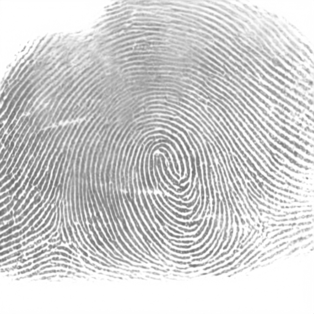
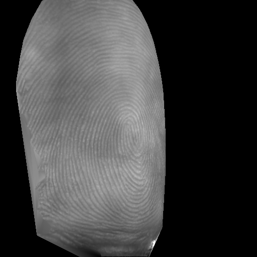
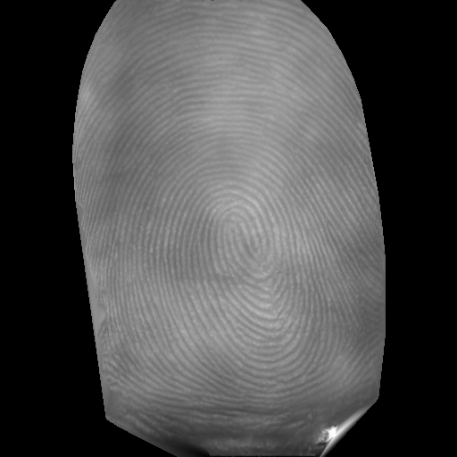
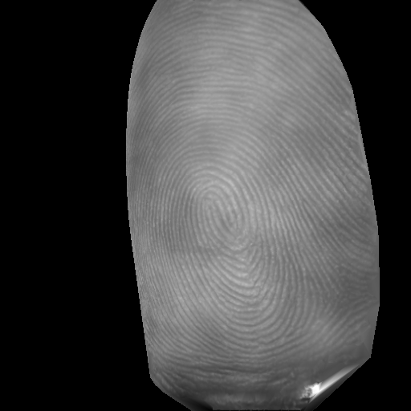

<div align="center">

# IMPOSE: Identity-Consistent Multi-Pose Generation of Contactless Fingerprints

**Identity-Consistent Multi-Pose Generation of Contactless Fingerprints**

[](https://arxiv.org/abs/2605.03830)
[](#-license)
[](https://www.tsinghua.edu.cn/)

[**Zhiyu Pan**](https://github.com/Yu-Yy), [**Xiongjun Guan**](https://github.com/XiongjunGuan), **Jianjiang Feng**, and **Jie Zhou**

**Department of Automation, Tsinghua University**

> **Under review**. Preprint available at [arXiv:2605.03830](https://arxiv.org/abs/2605.03830).

---

<p align="center">
  
  
  
  
</p>

*Generated rolled fingerprint identity and its contactless multi-pose renders under three roll angles (−35°, 0°, +27°).*

</div>

---

## 🔍 Overview

**IMPOSE** is a physics-inspired generative framework for synthesizing identity-consistent, multi-pose contactless fingerprint samples to improve cross-modal fingerprint recognition. This repository provides the **full code**, **pre-trained model weights**, and **large-scale generated datasets**.

The framework integrates three core stages:

- 🧬 **Identity Generation**: Synthesizing master rolled fingerprints via latent diffusion with discrete VQ-VAE codebook.
- 🌓 **Cross-Modal Translation**: Translating rolled to contactless modality via ControlNet, guided by Sauvola binarization as a deterministic identity anchor.
- 🔄 **Multi-Pose Simulation**: Projecting contactless textures onto 3D finger models and rendering under diverse roll angles.

---

## 📦 Released Data

We publicly release **IMPOSE-SYN**, the large-scale synthetic dataset generated by IMPOSE, usable for training and fine-tuning fixed-length fingerprint descriptors.

| Dataset | Description | Size | Download |
| :--- | :--- | :--- | :--- |
| **IMPOSE-SYN** | Rolled fingerprints (gallery) + multi-pose contactless fingerprints (query) | 1,712 + 15,136 images | [Google Drive](https://drive.google.com/drive/folders/1VYDTTkCG_iCnk-CjsgcqGLngyXOlSIZt?usp=sharing) |

All images are normalized to **512 × 512 px at 500 PPI**, aligned with the standard fingerprint coordinate system. Identities are sequentially numbered `00000`–`01711`.

---

## 🛠️ Environment Setup

- **GPU** with CUDA support
- **Python** ≥ 3.8

Install dependencies:

```bash
pip install numpy omegaconf Pillow opencv-python einops pytorch_lightning
pip install scipy matplotlib scikit-learn scikit-image tqdm
```

The code has been tested with **PyTorch 2.0.0 + CUDA 11.8**:

```bash
pip install torch==2.0.0 torchvision==0.15.1 --index-url https://download.pytorch.org/whl/cu118
```

This project builds on [Latent Diffusion Models](https://github.com/CompVis/latent-diffusion) and [taming-transformers](https://github.com/CompVis/taming-transformers). Relevant modules are already included under `ldm/`.

---

## 📥 Pre-Trained Model Weights

Download the checkpoints and place them under `models/`:

| Stage | Description | Download | Target Directory |
| :--- | :--- | :--- | :--- |
| **Rolled-Gen** | Rolled fingerprint identity synthesis | [Google Drive](https://drive.google.com/drive/folders/1p6hCoPb1xrYsKLMbxDxQ6bPqnTmhKeVM?usp=sharing) | `models/fingerprint_ldm_rolled_512/` |
| **Cross-Modal** | Contactless texture & modality transfer | [Google Drive](https://drive.google.com/drive/folders/1CNNgTiC0US60Lc-rSmOHJEKRF6aXxYPp?usp=sharing) | `models/fingerprint_c2cl_512/` |

Expected structure:

```
models/
├── fingerprint_ldm_rolled_512/
│   └── model_ldm_rolled.ckpt
└── fingerprint_c2cl_512/
    └── model_unsw_flat.ckpt
```

---

## 🚀 Quick Start

Example inputs and outputs are provided under `example/` for a quick trial.

### 1. Generate Rolled Fingerprints

```bash
python Rolled_FP_generation.py \
  --n_samples 4 --ddim_steps 50 --ddim_eta 0.0 --nums 10
```

| Argument | Default | Description |
| :--- | :--- | :--- |
| `--nums` | 10000 | Total number of images to generate |
| `--ddim_steps` | 50 | Number of DDIM sampling steps |
| `--ddim_eta` | 0.0 | DDIM stochasticity (0 = deterministic) |
| `--outdir` | `./example` | Output directory |

### 2. Quality Filtering (Optional)

Filter samples with **NFIQ 2.0 > 0.55** and **foreground ratio > 60%**. Pre-filtered examples: `example/source_rolled/`.

### 3. Ridge Enhancement (Sauvola)

```bash
python sauvola_simulation_contact.py
```

Reads from `example/source_rolled/` and `example/mask/`, writes to `example/binary_enhancement/`.

### 4. Cross-Modal Texture Generation

```bash
python cross_modal_generation.py \
  --img-folder example/binary_enhancement --ddim_steps 50
```

Outputs to `example/contactless_texture/`.

### 5. Multi-Pose Texture Mapping

```bash
python multi_pose_CL_generation.py
```

Uses 3D point clouds (`example/finger3d/`) and pose parameters (`example/finger3d_pose/`). Outputs to `example/multi_pose_CL/`.

---

## 📂 Repository Structure

```
IMPOSE/
├── Rolled_FP_generation.py          # Stage 1: rolled fingerprint generation
├── sauvola_simulation_contact.py    # Stage 2a: Sauvola binarization
├── cross_modal_generation.py        # Stage 2b: cross-modal texture translation
├── multi_pose_CL_generation.py      # Stage 3: physics-based multi-pose simulation
├── configs/
│   ├── fingerprint-ldm-vq-128-512-rolled.yaml
│   └── fingerprint-cldm-vq-128-512-contactless-eval.yaml
├── ldm/                             # Latent Diffusion Model modules
├── mapping/                         # 3D pose correction, unfolding, projection
├── example/                         # Example inputs & outputs for all stages
├── models/                          # (Download) Pre-trained checkpoints
└── README.md
```

---

## 📄 Citation

```bibtex
@article{pan2026impose,
  title={Identity-Consistent Multi-Pose Generation of Contactless Fingerprints},
  author={Pan, Zhiyu and Guan, Xiongjun and Feng, Jianjiang and Zhou, Jie},
  journal={arXiv preprint arXiv:2605.03830},
  year={2026}
}
```

---

## ⚠️ License

This project is licensed under the **Apache License 2.0**. See [LICENSE](LICENSE) for details.

---

## 📬 Contact

For technical issues: **Zhiyu Pan** — [pzy20@mails.tsinghua.edu.cn](mailto:pzy20@mails.tsinghua.edu.cn)

For research collaboration: **Jianjiang Feng** — [jfeng@tsinghua.edu.cn](mailto:jfeng@tsinghua.edu.cn)
